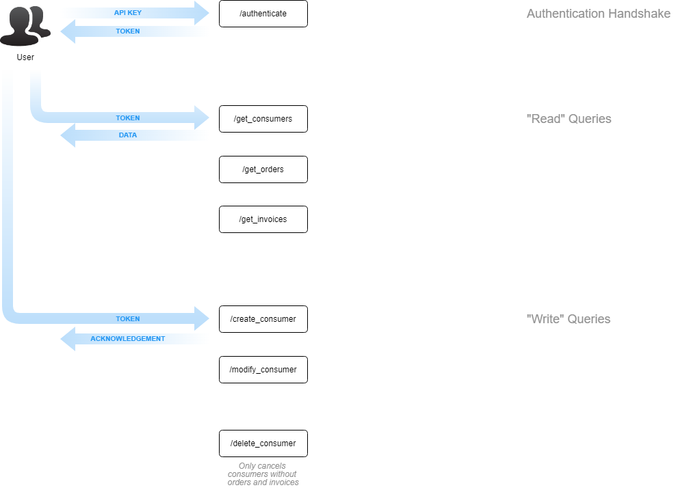

# API v1.2

## Overview

## Endpoints

### Authentication

- [authenticate](authenticate.md)

### Consumers

- [/get_consumers](get_consumers.md)
- [/create_consumer](create_consumer.md)
- [/modify_consumer](modify_consumer.md)
- [/delete_consumer](delete_consumer.md)

### Orders

Orders are a grouping of invoices.  Each orders has at least 1 invoice initially (a single amount to be collected from the consumer).  Future implementations of recurring billing will include multiple invoices per order.

- [/get_orders](get_orders.md)

### Invoices

Invoices represent the amount to be collected from the consumer, when it was received, and if there was any problems with processing the payment.

- [/get_invoices](get_invoices.md)

### Webhooks

Webhooks allow you to subscribe to have status updates sent to a url when certain actions occur within SmartPay.

The following topics are available to be subscribed to:
• invoice/created
• invoice/paid
• invoice/cancelled
• order/created
• order/cancelled

- [/get_invoices](get_invoices.md)